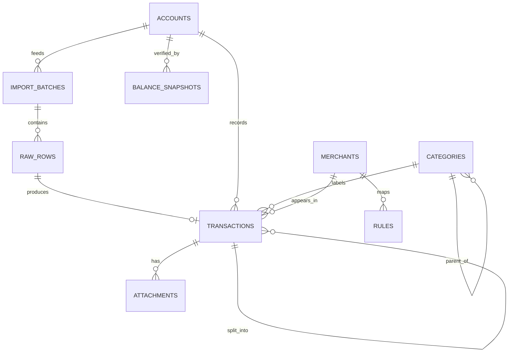
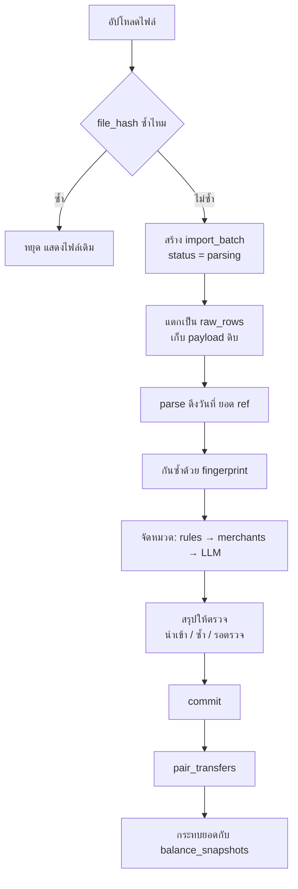
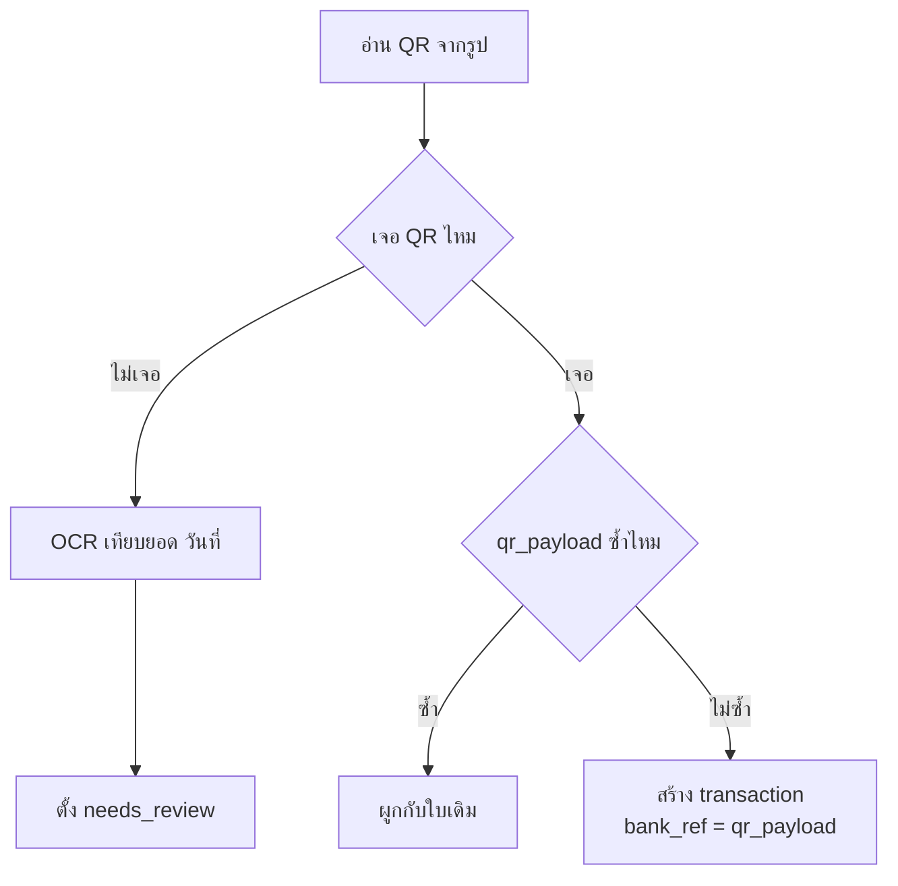

# ระบบบันทึกรายรับรายจ่ายอัตโนมัติ — เอกสารออกแบบ

> ขอบเขต: ใช้ส่วนตัว (คนเดียว) · เว็บ + อัปโหลดไฟล์ · Supabase (PostgreSQL 15)
> Stack: NestJS (API + worker) · Next.js (เว็บ) · Supabase (Postgres + Auth + Storage)
> สถานะ: schema เสร็จแล้ว (`001_schema.sql`, `002_functions.sql`) · seed ยังไม่ทำ

---

## 1. หลักการออกแบบ

ระบบนี้ไม่ใช่แอปบันทึกรายจ่ายทั่วไป แต่เป็น **pipeline แปลงข้อมูลดิบให้เป็นรายการที่เชื่อถือได้** โจทย์ที่ยากไม่ใช่การเก็บข้อมูล แต่คือ

1. รายการเดียวกันเข้ามาหลายรอบจากหลายแหล่ง → ต้องกันซ้ำให้ได้
2. การโอนเงินระหว่างบัญชีตัวเองไม่ใช่รายจ่าย → ต้องจับคู่สองขาให้เจอ
3. รูปแบบไฟล์ของแต่ละธนาคารเปลี่ยนได้ตลอด → ต้อง parse ใหม่ย้อนหลังได้

กฎ 3 ข้อที่ทุกอย่างในระบบยึดตาม

| กฎ | เหตุผล |
|---|---|
| **เก็บข้อมูลดิบไว้เสมอ** (`raw_rows.payload`) | parser พลาดแล้วแก้ใหม่ได้โดยไม่ต้องขอไฟล์จากผู้ใช้อีก |
| **ทุกอย่างเข้าระบบผ่าน `import_batches`** | ย้อนกลับได้ทั้งก้อน รู้ว่าข้อมูลมาจากไหน |
| **รายงาน query จาก `v_ledger` เท่านั้น** | กันการนับการโอนภายในเป็นรายจ่ายโดยไม่ตั้งใจ |

---

## 2. แหล่งข้อมูล

เว็บอย่างเดียวหมายความว่าไม่มี stream แบบ real-time ทุกอย่างมาเป็นก้อน

| แหล่ง | ความแม่น | ใช้ทำอะไร |
|---|---|---|
| **สลิปโอนเงิน** (save ตรงจากแอปธนาคาร) | สูงมาก ถ้าอ่าน QR ได้ | รายการรายวัน บันทึกทันทีที่โอน |
| **Statement CSV / PDF** | สูงสุด | source of truth ปิดยอดรายเดือน |
| **กรอกเอง** | — | เงินสด รายการที่ไม่มีหลักฐาน |

**ที่ตัดออกและเหตุผล** — SMS และ notification listener ใช้ไม่ได้เพราะเป็นเว็บ, การเรียก Slip Verification API ของธนาคารโดยตรงต้องใช้บัญชีนิติบุคคล ไม่คุ้มกับการใช้ส่วนตัว จึงให้ QR ทำหน้าที่เป็น **identity ของรายการ** อย่างเดียว ส่วนยอดกับวันที่เอาจาก OCR แล้วให้คนยืนยัน

---

## 3. โครงสร้างข้อมูล



### ตารางทั้งหมด

| ตาราง | หน้าที่ |
|---|---|
| `accounts` | บัญชีธนาคาร / บัตรเครดิต / เงินสด / e-wallet |
| `categories` | หมวดหมู่ 2 ระดับ ใช้ `parent_id` อ้างตัวเอง |
| `merchants` | ร้านค้า + ชื่อพ้องที่เจอในสเตทเมนต์ (`aliases`) |
| `rules` | กฎจัดหมวดที่ผู้ใช้ตั้งเอง ทำงานก่อน merchant dictionary |
| `import_batches` | ทางเข้าเดียวของข้อมูล `file_hash` unique |
| `raw_rows` | แถวดิบจากไฟล์ + ผลจาก parser ที่รอ commit |
| `transactions` | รายการจริง ใช้ `parent_id` แยกบิลเป็นหลายหมวด |
| `attachments` | ไฟล์สลิป เก็บ hash + uri + `qr_payload` |
| `balance_snapshots` | ยอดคงเหลือจากสเตทเมนต์ ใช้กระทบยอด |
| `budgets` | งบรายเดือนต่อหมวด |
| `jobs` | คิวงานของ worker ใช้ Postgres เป็นคิว ไม่ต้องมี Redis |

DDL เต็มอยู่ใน `001_schema.sql`, `002_functions.sql` และ `003_add_staging.sql`

### ที่พักข้อมูลระหว่างรอ commit

ช่องว่างที่เจอตอนเขียน orchestrator: เราตกลงว่ายังไม่มีอะไรลง `transactions` จนกว่าจะ commit แต่ผลจาก parse ต้องพักไว้ที่ไหนสักแห่ง วิธีที่เลือกคือ **ขยาย `raw_rows` ไม่เพิ่มตาราง shadow**

```sql
-- 003_add_staging.sql
alter table raw_rows
  add column parsed     jsonb,          -- ผลจาก parser ตาม ParsedRow
  add column dedupe     text            -- 'new' | 'duplicate' | 'review'
             check (dedupe in ('new','duplicate','review')),
  add column dup_of     uuid references transactions on delete set null,
  add column proposed_category_id uuid references categories on delete set null;

create table jobs (
    id         bigserial primary key,
    kind       text not null,
    args       jsonb not null,
    run_after  timestamptz not null default now(),
    attempts   int not null default 0,
    locked_at  timestamptz,
    done_at    timestamptz,
    last_error text
);
create index on jobs (run_after) where done_at is null;
```

ทางเลือกอื่นคือ insert ลง `transactions` ด้วย `status = 'pending'` แต่จะเลอะกว่า เพราะทุก query รายงานต้องจำไว้ตลอดว่าให้กรอง pending ออก แล้ววันหนึ่งจะลืม

### คอลัมน์ที่ต้องเข้าใจก่อนเขียนโค้ด

**`amount numeric(14,2)` ติดลบ = เงินออก**
ห้ามใช้ float และห้ามแยกเป็น `direction` + ยอดบวก ไม่งั้นทุก query จะต้องมี `case when` ไปตลอดชีวิต ใช้ signed amount แล้ว `sum()` ได้ตรง ๆ

**`occurred_at timestamptz` คู่กับ `booked_date date`**
รายการตอนตี 1 ของวันที่ 1 ถ้าคำนวณเดือนจาก timestamp ที่เป็น UTC จะไปตกเดือนก่อนหน้า `booked_date` คือวันตามเวลาไทยที่ freeze ไว้แล้ว **ใช้ group เดือนจากตัวนี้เท่านั้น**

**`fingerprint`** = `sha256(account_id | booked_date | amount | bank_ref หรือ description ที่ normalize แล้ว)`
มี unique index เฉพาะรายการแม่ที่ยังไม่ยกเลิก คำนวณโดย trigger `tx_before_write()` ทุกครั้งที่เขียน

**`locked_fields text[]`**
เก็บชื่อคอลัมน์ที่ผู้ใช้แก้เอง เช่น `{category_id,note}` เวลา re-import ไฟล์ที่ช่วงเวลาทับกัน ให้ merge เฉพาะฟิลด์ที่ไม่อยู่ในนี้ ไม่งั้นหมวดที่นั่งจัดมาทั้งเดือนหายหมดในคลิกเดียว

**`transfer_group_id uuid`**
สองขาของการโอนระหว่างบัญชีตัวเองใช้ค่าเดียวกัน รายงานทุกตัวต้อง `where transfer_group_id is null`

**`parent_id`** ใช้แยกบิลใบเดียวเป็นหลายหมวด (เช่น บิล Makro = ของกิน + ของใช้บ้าน) รายการแม่เก็บยอดจริง รายการลูกคือส่วนย่อย มี constraint trigger บังคับว่ายอดรวมลูกต้องเท่าแม่เสมอ

---

## 4. ขั้นตอนการนำเข้า



**ยังไม่มีอะไรลง `transactions` จนกว่าจะ commit** batch ค้างที่สถานะ `review` ผู้ใช้เห็นสรุปแล้วกดยืนยันทีเดียว ถ้าผิดก็เรียก `revert_batch()` ทิ้งทั้งก้อน

**สองอย่างที่รันหลัง commit ไม่ใช่ตอนนำเข้า**

- `pair_transfers()` — ขาโอนเข้ากับขาโอนออกมักมาจากคนละไฟล์คนละเวลา ถ้ารันตอน insert จะจับไม่เจอเกือบทุกครั้ง
- กระทบยอด — เช็ค `v_account_balance` ถ้า `diff` ไม่เป็นศูนย์แปลว่ามีรายการหายหรือเกิน

---

## 5. การกันซ้ำ

ทำเป็น 4 ชั้น เจอชั้นไหนก่อนจบที่ชั้นนั้น

| ชั้น | กุญแจ | จับอะไร |
|---|---|---|
| 1 | `import_batches.file_hash` | ไฟล์เดิมที่ลากมาวางซ้ำ |
| 2 | `attachments.qr_payload` | สลิปใบเดิมที่ถูก resize / ส่งต่อมาหลายทอด |
| 3 | `transactions.fingerprint` | รายการเดียวกันจากคนละแหล่ง (สลิป vs statement) |
| 4 | fuzzy key + `needs_review` | สลิปที่อ่าน QR ไม่ออก — ให้คนตัดสิน ห้ามลบเอง |

### ทำไมต้องใช้ QR ไม่ใช่ OCR



ถ้าใช้ **วันที่ + เวลา + ยอด + รายละเอียด** จาก OCR เป็นตัวกันซ้ำหลัก จะมีรู 3 จุด

- **OCR ไม่นิ่ง** — `฿1,250.00` กับ `1,250.00`, ชื่อผู้รับตกสระ ทำให้ hash ไม่ตรงแล้วมองเป็นคนละรายการ
- **เวลาบนสลิปมีแค่ระดับนาที** — โอน 60 บาทให้ร้านเดิมสองครั้งในนาทีเดียวกัน ระบบจะกินไปหนึ่งรายการแบบเงียบ ๆ
- **สลิปซ้ำกับ statement เป็นคนละชั้นกัน** — การกันซ้ำระดับไฟล์ไม่ช่วยเลย

ส่วน `qr_payload` เป็นสตริงเฉพาะของรายการนั้น (มี transaction ref + CRC อยู่ข้างใน) สลิปใบเดิมจะได้สตริงเดิมเป๊ะทุกตัวอักษร **ถ้าใช้แค่กันซ้ำ ไม่ต้องแกะ payload เลย** ใส่ unique index ตรง ๆ ได้ทันที

**บรรทัดที่สำคัญที่สุดของทั้งระบบ**: เอา `qr_payload` ไปใส่ `bank_ref` ด้วย ทำให้ `fingerprint` ของรายการจากสลิปชนกับรายการเดียวกันจากไฟล์ statement โดยอัตโนมัติ ไม่ต้องเขียนโค้ดจับคู่ข้ามแหล่งเพิ่มเลย

### โค้ดอ่าน QR

สลิปที่ save ตรงจากแอปธนาคารเป็นภาพที่ถูก render ใหม่ ไม่ผ่านการบีบอัดซ้ำ อ่านออกตั้งแต่ครั้งแรกแทบทุกใบ

```ts
// adapters/qr-reader.ts (ย่อ)
export async function readSlipQr(data: Buffer): Promise<string | null> {
  const full = await decodeToRgba(data, (s) => s.grayscale());   // sharp
  if (!full) return null;

  const first = await readOne(full);                             // zxing-wasm
  if (first) return first;

  // เผื่อใบที่หลุด: crop ครึ่งล่าง (QR มักอยู่ล่างสุด) ขยาย 2 เท่า ลองอีกรอบเดียว
  return readSlipQrCropped(data);
}
```

ใช้ `zxing-wasm` ซึ่งคือ `zxing-cpp` ตัวเดียวกันคอมไพล์เป็น WASM — ได้ผลดีกับ QR เล็กและหนาแน่นแบบบนสลิป ถ้าสลิปเป็น PDF ให้ render ที่ 300dpi ก่อนเสมอ (`renderPdfFirstPage()`) อย่าอ่านจากภาพตัวอย่าง

**ยังต้องมีสาย `qr_status = 'unreadable'`** เผื่อสลิปที่คนอื่นส่งมาทาง LINE (LINE บีบอัดรูปทุกใบที่ส่งผ่านแชต) คาดว่าเจอไม่เกิน 2-3%

---

## 6. การจัดหมวด

ไล่จากถูกไปแพง เจอแล้วหยุด

1. **`rules`** — กฎที่ผู้ใช้ตั้งเอง เรียงตาม `priority`
2. **`merchants.aliases`** — ชื่อร้านในสเตทเมนต์ไทยมักเพี้ยน (`7-ELEVEN 12345`, `CPALL`, `BIGC 0231`)
3. **LLM** — เฉพาะร้านที่ไม่เคยเจอ แล้ว **cache ผลลง `merchants` ถาวร** ร้านเดิมจะไม่เรียก LLM ซ้ำอีกเลย

ทุกครั้งที่ผู้ใช้แก้หมวดเอง ให้เสนอสร้าง rule ใหม่อัตโนมัติ — แก้ครั้งเดียวคุ้มกว่าพยายามทำให้แม่น 100% ตั้งแต่แรก

---

## 7. สถาปัตยกรรมโค้ด

**hexagonal แบบเบา** — core ไม่รู้จัก DB เลย เพราะส่วนที่จะแก้บ่อยที่สุดคือ parser ของแต่ละธนาคาร ต้องเขียนเทสได้โดยไม่ต้องยก Postgres ขึ้นมา

```
apps/api/src/
├── core/                      # ไม่ import อะไรจากชั้นนอกเลย
│   ├── models.ts              # interface ของ domain (ไม่ใช่ ORM)
│   ├── fingerprint.ts
│   ├── dedupe.ts
│   ├── categorize.ts
│   └── parsers/
│       ├── base.ts            # interface Parser + ParsedRow + helper วันที่ไทย
│       ├── registry.ts        # sniff แล้วเลือก parser เอง
│       ├── kbank-csv.ts
│       ├── scb-statement-pdf.ts
│       ├── pdf-text.ts
│       └── slip-image.ts
├── adapters/
│   ├── qr-reader.ts           # sharp + zxing-wasm
│   └── thai-ocr.ts            # tesseract.js
├── db/
│   ├── pool.ts                # node-postgres + type parser (numeric → string)
│   ├── uow.ts                 # unit of work / transaction boundary
│   └── repos/                 # SQL ดิบ ไม่ใช้ ORM
├── storage/                   # Supabase Storage
├── auth/                      # ตรวจ JWT ของ Supabase Auth ด้วย JWKS
├── modules/                   # use case + controller
│   ├── import/  review/  report/  accounts/
├── worker/                    # job runner (Postgres เป็นคิว)
├── main.ts                    # API process
└── worker.ts                  # worker process

apps/web/                      # Next.js App Router
packages/shared/               # type + zod schema ที่ทั้งสองฝั่งใช้ร่วมกัน
supabase/migrations/           # SQL ทั้งหมด
```

ทิศทางการพึ่งพาเป็นทางเดียว: `modules` → `core` ← `db` / `adapters`
**ชั้น `core` ห้าม import ชั้นนอกเด็ดขาด** ให้รับค่าเข้ามาเป็น argument แทน
(เช่น `SlipImage` รับ QR/OCR reader เป็น callable ตอน construct — ประกอบร่างที่ `parsers.module.ts`)

### Parser: ให้ระบบเดาเองว่าไฟล์นี้ของธนาคารไหน

อย่าให้ผู้ใช้ต้องเลือกธนาคารจาก dropdown ก่อนอัปโหลด ให้แต่ละ parser บอกเองว่ามั่นใจแค่ไหน

```ts
// core/parsers/base.ts
export interface ParsedRow {
  bookedDate: string;           // 'YYYY-MM-DD' ตามเวลาไทย ไม่ใช่ Date (กัน UTC เลื่อนข้ามวัน)
  amount: Decimal;              // ติดลบ = เงินออก
  occurredAt: Date | null;
  descriptionRaw: string | null;
  counterparty: string | null;
  bankRef: string | null;       // เลขอ้างอิงธนาคาร หรือ qr_payload
  balanceAfter: Decimal | null;
  confidence: number;           // 0.0-1.0
  payload: Record<string, unknown>;   // แถวดิบ ลง raw_rows
}

export interface Parser {
  readonly name: string;
  readonly source: BatchSource;       // 'csv' | 'statement_pdf' | 'slip_image'

  /** คืน 0.0-1.0 ว่าไฟล์นี้เป็นของ parser ตัวนี้แค่ไหน */
  sniff(raw: Buffer, filename: string): Promise<number>;

  /** แปลงทั้งไฟล์ ห้าม throw กลางทาง — แถวที่พังให้ confidence = 0 */
  rows(raw: Buffer): AsyncIterable<ParsedRow>;
}
```

```ts
// core/parsers/registry.ts
async pick(raw: Buffer, filename: string, threshold = 0.5): Promise<Parser> {
  const scored = await Promise.all(
    this.parsers.map(async (p) => {
      try {
        return { score: await p.sniff(raw, filename), parser: p };
      } catch {
        return { score: 0, parser: p };   // parser ที่ sniff พังต้องไม่ล้มทั้งกอง
      }
    }),
  );
  scored.sort((a, b) => b.score - a.score);

  const best = scored[0];
  if (!best || best.score < threshold) {
    throw new NoParserMatched(`ไม่รู้จักรูปแบบไฟล์นี้ ตัวที่ใกล้สุดคือ ${best.parser.name}`);
  }
  return best.parser;
}
```

`rows()` **ห้าม throw กลางทาง** เป็นกฎที่สำคัญกว่าที่เห็น — ถ้าไฟล์ 200 แถวพังที่แถว 137 แล้วโยน exception ทิ้ง ผู้ใช้จะไม่ได้อะไรเลย ให้แถวนั้น `confidence = 0` แล้วไปต่อ เดี๋ยวมันไปกองในคิวรอตรวจเอง

### ImportService: แยก sync กับ async

```ts
// modules/import/import.service.ts (ย่อ)
// ---- ชั้นที่ 1: sync เร็ว ตอบผู้ใช้ทันที ----
async stage(raw: Buffer, filename: string, accountId: string | null): Promise<StageResult> {
  const fileHash = createHash('sha256').update(raw).digest('hex');

  const existing = await this.uow.read((tx) => tx.batches.byHash(fileHash));
  if (existing) return { batchId: existing.id, duplicateFile: true };

  const uri = await this.objstore.put(`imports/${fileHash}`, raw, contentTypeOf(filename));

  return this.uow.run(async (tx) => {
    const again = await tx.batches.byHash(fileHash);   // สองแท็บอัปพร้อมกันได้
    if (again) return { batchId: again.id, duplicateFile: true };

    const batch = await tx.batches.create({ accountId, fileName: filename, fileHash,
                                            fileUri: uri, source: 'manual', status: 'parsing' });
    await tx.jobs.enqueue('parse_batch', { batch_id: batch.id });
    return { batchId: batch.id, duplicateFile: false };
  });
}

// ---- ชั้นที่ 2: worker ----
async parse(batchId: string): Promise<void> {
  const batch = await this.uow.read((tx) => tx.batches.get(batchId));
  const raw = await this.objstore.get(batch.file_uri);
  const parser = await this.registry.pick(raw, batch.file_name ?? '');   // fail → batches.fail()

  // อ่านไฟล์ทั้งก้อนนอก transaction ก่อน: OCR สลิปใช้เวลาหลายวินาที
  // ถ้าทำในทรานแซกชันจะจับ connection ค้างไว้ทั้งช่วง
  const parsedRows: ParsedRow[] = [];
  for await (const row of parser.rows(raw)) parsedRows.push(row);

  await this.uow.run(async (tx) => {
    for (const [i, row] of parsedRows.entries()) {
      const verdict = await classify(row, batch.account_id, tx.transactions);
      await tx.rawRows.upsert({ batchId, lineNo: i, payload: row.payload,
        rowHash: hashRow(row.payload), parsed: parsedRowToJson(row),
        dedupe: verdict.kind, dupOf: verdict.dupOf,
        proposedCategoryId: await suggest(row, tx.categorize),
        confidence: row.confidence,
        parseStatus: row.confidence > 0 ? 'parsed' : 'error' });
    }
    await tx.batches.toReview(batchId, counts);
  });
}
```

**การ enqueue งานต้องอยู่ใน transaction เดียวกับการสร้าง batch** ถ้าใช้ Redis/BullMQ จะทำไม่ได้ — งานถูก enqueue แล้วแต่ insert batch fail กลายเป็น job ที่ชี้ไปยัง batch ที่ไม่มีอยู่ ใช้ Postgres เป็นคิวเลยดีกว่า ระบบคนเดียวไม่ต้องมี Redis ให้ดูแล (เหตุผลนี้ยังยืนอยู่หลังย้ายมา Nest จึงไม่เปลี่ยนไป BullMQ)

```ts
// db/repos/job.repo.ts
export const CLAIM_SQL = `
update jobs set locked_at = now(), attempts = attempts + 1
 where id = (select id from jobs
              where done_at is null and locked_at is null
                and run_after <= now()
              order by run_after
              for update skip locked
              limit 1)
returning id, kind, args
`;
```

`for update skip locked` ทำให้รัน worker หลายตัวขนานได้โดยไม่แย่งงานกัน และงานไม่หายถ้า worker ตาย

### Dedupe: แยก "ตัดสิน" ออกจาก "ลงมือ"

```ts
// core/dedupe.ts
export async function classify(row: ParsedRow, accountId: string, q: DedupeQueries)
  : Promise<Verdict> {
  // ชั้น 2: QR (ยัดไว้ใน bankRef) — แม่นที่สุด ถ้ามีก็จบ
  if (row.bankRef) {
    const hit = await q.byBankRef(accountId, row.bankRef);
    if (hit) return verdict('duplicate', hit, 'bank_ref ตรงกัน');
  }

  // ชั้น 3: fingerprint
  const fp = fingerprint(accountId, row.bookedDate, row.amount, row.bankRef, row.descriptionRaw);
  const fpHit = await q.byFingerprint(fp);
  if (fpHit) return verdict('duplicate', fpHit, 'fingerprint ตรงกัน');

  // ชั้น 4: ใกล้เคียง — ห้ามตัดสินเอง
  const near = await q.near(accountId, row.bookedDate, row.amount, 1);
  if (near.length > 0) return verdict('review', near[0], `คล้ายกับ ${near.length} รายการที่มีอยู่`);

  return row.confidence >= CONFIDENCE_THRESHOLD
    ? verdict('new')
    : verdict('review', null, 'parse ไม่มั่นใจ');
}
```

ฟังก์ชันนี้ไม่แตะ DB เอง — รับ query interface เข้ามา ทำให้เทสเคส "โอน 60 บาทสองครั้งในนาทีเดียวกัน" ได้ด้วย fake ไม่กี่บรรทัด นี่คือส่วนที่จะพังเงียบที่สุดถ้าไม่มีเทส (`apps/api/test/dedupe.spec.ts`)

### Commit: จุดเดียวที่เขียน transactions

```ts
// modules/review/commit.service.ts (ย่อ)
async commit(batchId: string, { accountId, overrides, skipRowIds }: CommitBatchInput) {
  return this.uow.run(async (tx) => {            // atomic ทั้งก้อน
    const rows = await tx.rawRows.forCommit(batchId, skipRowIds);  // เฉพาะ dedupe != 'duplicate'
    for (const r of rows) {
      const override = overrides[r.id] ?? {};
      const data = { ...carriedFrom(r.parsed), ...override };

      // ผู้ใช้กดยืนยันว่าไม่ซ้ำ: ต้องให้ bank_ref ต่างจากใบเดิม ไม่งั้นชน unique index tx_dedupe
      if (r.dup_of && !data.bank_ref) data.bank_ref = `manual#${r.id}`;

      await tx.transactions.insert({ ...data, account_id: accountId, raw_row_id: r.id,
        import_batch_id: batchId,
        category_id: override.category_id ?? r.proposed_category_id ?? null,
        locked_fields: Object.keys(override),     // กัน re-import ทับ
        needs_review: r.dedupe === 'review' });
    }
    await tx.batches.markCommitted(batchId);
    await tx.jobs.enqueue('pair_transfers', {});
    await tx.jobs.enqueue('reconcile', { account_id: accountId });
  });
}
```

`locked_fields` เซ็ตจาก key ของ `overrides` โดยตรง — อะไรที่ผู้ใช้แก้ในหน้าตรวจ ถือว่าล็อกทันที ไม่ต้องให้กดอะไรเพิ่ม

### Stack

**NestJS + node-postgres + Next.js (App Router) + Supabase** ยังไม่ใช้ ORM ด้วยเหตุผลเดิม — query หลักของระบบเป็น window function กับ CTE ที่ ORM สู้ไม่ได้ (`pair_transfers`, `v_ledger`) เขียน SQL ตรง ๆ ใน repo แล้วทำ mapper บาง ๆ ชัดกว่า

Supabase ทำสามอย่าง: **Postgres** (schema เดิมทั้งหมดใช้ได้ ไม่ต้องแก้), **Auth** (ปิดช่องว่างข้อ 11 ที่เดิมยังไม่มี auth), **Storage** (แทน object store ที่เดิมเขียนลงดิสก์) ตาราง public ทุกตัวเปิด RLS โดยไม่สร้าง policy — Nest ต่อ Postgres ตรงด้วย service credentials ซึ่ง bypass RLS อยู่แล้ว ส่วน anon key ที่หลุดไปถึง browser จะอ่านอะไรไม่ได้เลย ข้อมูลออกทาง Nest API ทางเดียว

frontend แยกออกมาเป็น Next.js แทน Jinja + HTMX ราคาที่จ่ายคือมี process เพิ่มอีกตัวและต้องดูแล contract ระหว่างสองฝั่ง — แก้ด้วย `packages/shared` ที่เก็บ type กับ zod schema ไว้ที่เดียว ใช้เป็นทั้ง validation ของ API และ type ของหน้าเว็บ

deploy เป็นสอง process (API + worker) ต่อ Supabase Postgres ส่วน backup ใช้ของ Supabase เอง ไม่ต้องตั้ง `pg_dump` cron เอง

**ที่เปลี่ยนแล้วต้องระวัง** — parser ย้ายจาก Python มา TypeScript ทั้งหมด: `opencv + zxing-cpp` → `sharp + zxing-wasm` (zxing ตัวเดียวกันคอมไพล์เป็น WASM), `pytesseract` → `tesseract.js`, `pdfplumber` → `pdfjs-dist` ตัวที่เสี่ยงที่สุดคือ OCR ไทยของ `tesseract.js` ที่แม่นน้อยกว่า ต้องทดสอบกับสลิปจริงก่อนเชื่อ — แต่ OCR เป็นแค่สายสำรอง ตัวกันซ้ำหลักยังเป็น QR เหมือนเดิม

---

## 8. เรื่องที่พลาดบ่อย

**การจ่ายบิลบัตรเครดิตคือ transfer ไม่ใช่รายจ่าย** รายจ่ายจริงคือรายการที่รูดไปตอนนั้น ถ้านับทั้งสองอย่างจะเบิ้ลทุกเดือน

**วันที่บนสลิปเป็น พ.ศ.** `12 ก.ย. 2568` ต้องแปลงเป็น 2025 และ map ชื่อเดือนย่อภาษาไทยเอง ให้มี validation ว่าถ้าปีที่ได้ > ปีปัจจุบัน + 1 ให้ถือว่า parse ผิดทันที

**บัตรเครดิตมี pending กับ posted** ยอดตอนรูดอาจไม่เท่ากับยอดตัดจริง (ทิป ค่าแปลงสกุล) ต้อง match แล้ว update ไม่ใช่ insert ใหม่

**อย่าเก็บไฟล์รูปเป็น `bytea`** เก็บแค่ `file_hash` + `file_uri` ตัวไฟล์ไว้ object storage รูปสลิปใบละ 200KB สะสมเป็นพันใบทำให้ backup ช้าลงสิบเท่าโดยไม่ได้ประโยชน์

**refund / void** ต้องอ้างถึงรายการเดิม ไม่ใช่สร้างรายการใหม่ลอย ๆ

---

## 9. ทางเลือก: SQLite

ธุรกรรมส่วนตัวสิบปีไม่ถึงแสนแถว SQLite รันได้สบายบนไฟล์เดียว backup คือ copy ไฟล์ + Litestream ส่ง snapshot ขึ้น S3 ถ้าจะเปลี่ยนต้องแก้ 3 จุด

- `uuid` → `text` (ใช้ UUIDv7 หรือ ULID จะได้เรียงตามเวลาด้วย)
- `numeric(14,2)` → `integer` เก็บเป็นสตางค์ (**ห้ามใช้ REAL**)
- `text[]` → คอลัมน์ json แล้วใช้ `json_each` ตอน query

---

## 10. สิ่งที่ยังไม่ได้ตัดสินใจ

| หัวข้อ | ตัวเลือก |
|---|---|
| การ commit | กดยืนยันทุก batch (ปลอดภัย) **vs** ไฟล์ที่มั่นใจ 100% เข้าเลย เหลือหน้าตรวจเฉพาะที่มีปัญหา (ลื่นกว่า) |
| สลิปที่อ่าน QR ไม่ออก | เข้าระบบพร้อมธง `needs_review` **vs** กักไว้จนยืนยัน (ปลอดภัยกว่าแต่ลืมค้างในคิวได้) |

---

## 11. งานที่เหลือ

### ทำแล้ว

- [x] `003_add_staging.sql` — คอลัมน์ staging บน `raw_rows` + ตาราง `jobs`
- [x] `004_seed_categories.sql` — หมวดหมู่ภาษาไทย 2 ระดับ
- [x] `005_seed_merchants_rules.sql` — ร้านค้าไทยที่เจอบ่อย + rule ตั้งต้น
- [x] scaffold โครงโปรเจกต์ + `core/parsers/base.ts` + `registry.ts`
- [x] worker runner + `parse_batch` job
- [x] parser สลิป (อ่าน QR + OCR ไทย) — adapters ฉีดเข้ามา ไม่ import ตรง
- [x] เทส `core/dedupe.ts` ด้วย fake query — เคสโอนยอดเท่ากันในนาทีเดียวกัน
- [x] parser statement — `kbank-csv.ts` + `scb-statement-pdf.ts` **ยังไม่ได้ทดสอบกับไฟล์จริง**
- [x] หน้าเว็บ: อัปโหลด, คิวรอตรวจ, หน้าตรวจรายบรรทัด, รายงานรายเดือน, กระทบยอด
- [x] **auth/session** — Supabase Auth (magic link) + guard ที่ตรวจ JWT ด้วย JWKS
- [x] **ฟอร์มแก้ไขรายบรรทัดก่อน commit** — แก้วันที่/หมวด/หมายเหตุ และติ๊กข้ามรายแถวได้
      ฟิลด์ที่แก้จะกลายเป็น `locked_fields` อัตโนมัติ
- [x] ย้าย stack เป็น NestJS + Next.js + Supabase (ดูหัวข้อ 7)

### ยังไม่เสร็จ / ยังไม่ผ่านการทดสอบจริง

- [ ] ยังไม่เคยรันกับ Supabase จริง — migration ผ่านแค่การอ่าน ยังไม่ integration test
- [ ] `kbank-csv.ts` / `scb-statement-pdf.ts` เป็น mapping เดาไว้ก่อน ต้อง dump payload ของไฟล์จริงมาเทียบ
- [ ] OCR ไทยของ `tesseract.js` แม่นน้อยกว่า `pytesseract` ของเดิม ต้องวัดกับสลิปจริงว่ายอมรับได้ไหม
      (ถ้าไม่ไหว ทางออกคือแยก OCR ออกเป็น service Python ตัวเล็ก ๆ ที่ Nest เรียกผ่าน HTTP)
- [ ] สลิปที่เป็น PDF ต้องมี `@napi-rs/canvas` ถึงจะ render อ่าน QR ได้ (ถ้าไม่มี โค้ด degrade เป็น unreadable)
- [ ] ยังไม่มีหน้าจัดการบัญชี/หมวดหมู่/งบประมาณบนเว็บ (API `POST /api/accounts` มีแล้ว)
- [ ] ยังไม่ได้เขียน LLM classifier ตัวจริง (`LLMClassifier` เป็น interface ที่ยังไม่มี implementation)

โครงสร้างจริงอยู่ใต้ `apps/` กับ `packages/` (ดูหัวข้อ 7) — migrations 7 ไฟล์อยู่ที่ `supabase/migrations/`
